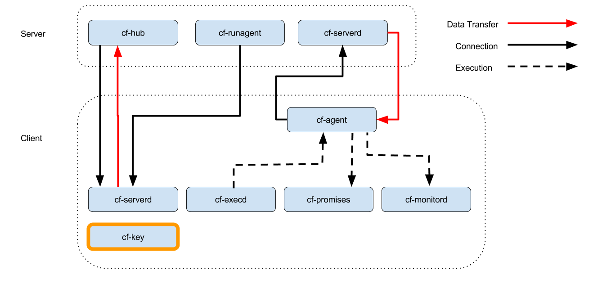
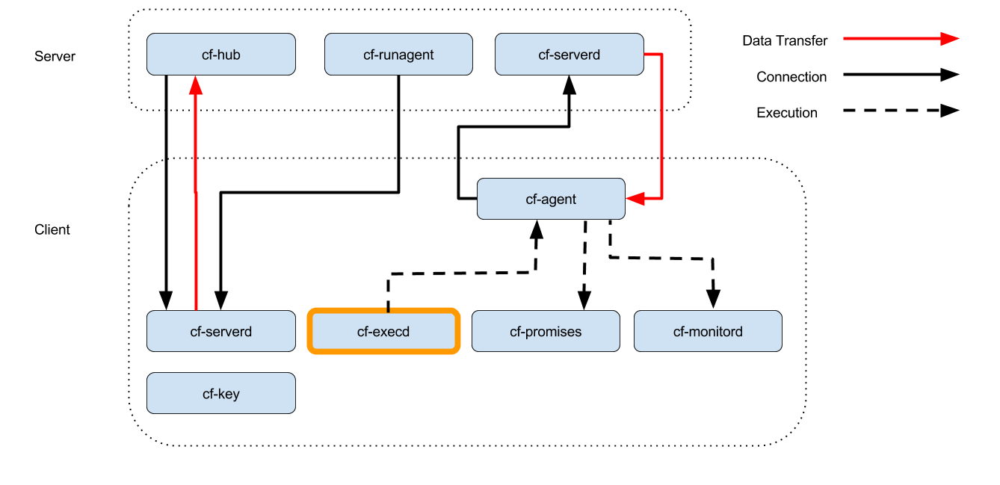
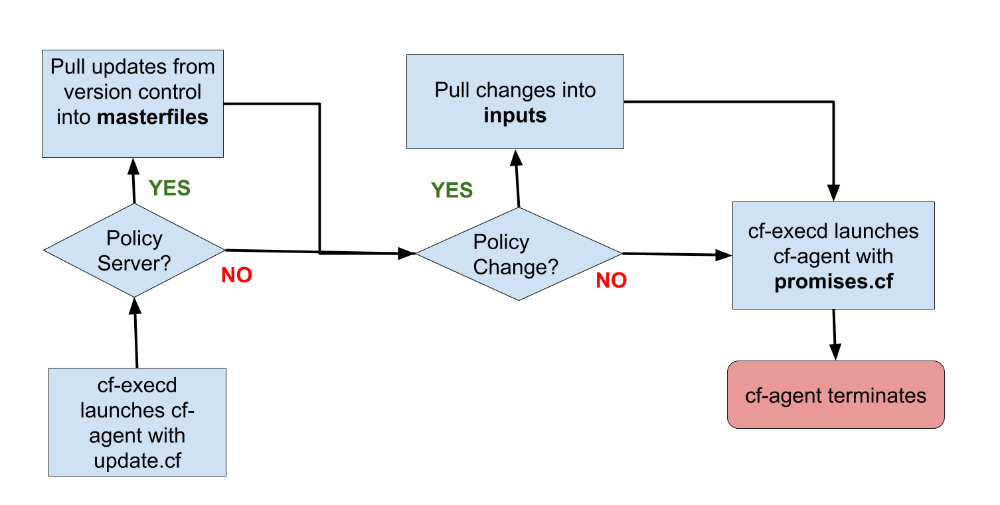

# Agent Components

.fx: titleslide

---
## Diagram

---
## cf-hub diagram

---
## cf-hub details
- Collect reports from remote agents
- Obeys “common control” and “hub control” bodies

---
## cf-runagent diagram

---
## cf-runagent details
- Invokes cf-agent on remote hosts
- Normally run on the server to “ping” the clients
- Cannot invoke arbitrary commands - just wake up cf-agent
- Define classes to modify behavior

---
## cf-serverd diagram

---
## cf-serverd details
* Listens for connections on port TCP/**5308**
* Enforces access control and authentication
* Serves files
* Serves cf-runagent requests
* Serves reports to cf-hub
* Runs on both server and clients
* Evaluates "common" and "server" bundles
* Obeys body "server control"

---
## cf-key diagram

---
## cf-key details
- Show recent connections
- Manage trust of public keys
- Generates key pairs
- Installs Enterprise License

---
## cf-promises diagram

---
## cf-promises details
- Checks Syntax
- Performs pre-evaluation & discovery
- Dump Syntax
- Tag Policy Releases
- Show Variables
- Show Classes

---
## Pro Tip: Syntax Checking
.notes: Consider places that you can automate this. Editors, vcs hooks, build systems.

### Full syntax check:

    !console
    $ cf-promises --eval-functions yes --full-check \
                  -f ./examples/00-01-hello_world.cf

### Partial syntax check:

    !console
    $ cf-promises -f ./examples/00-01-hello_world.cf

## presenter notes

Its typical to wire full policy syntax checks into pre-commit hooks or have
them run by a continuous integration system like Jenkins.

Partial checks are useful to run while developing policy, and depending on the
editor, you may be able to do this as a save hook.

---
## cf-monitord diagram

---
## cf-monitord details
- Collect system status information
- Provides information to cf-agent through `mon.*` variables
- Defines classes based on anomaly detection
- Evaluates "common" and "monitor" bundles
- Obeys "common control" and "monitor control" bodies

---
## cf-execd diagram

---
## cf-execd details
- Executes cf-agent periodically
- Controls period and splay time
- Collects, stores and sends output
- Evaluates “common” bundles
- Obeys “executor control” body

---
## cf-agent diagram

---
## cf-agent details
- The Catalyst or instigator of change
- Evaluates "agent" and "common" bundles
- Obeys "common control" and "agent control" bodies.
- By default runs /var/cfengine/inputs/promises.cf

## presenter notes
cf-agent is the agent of change, its the pointy end of the stick, or the
dangerous end of the gun.

---
## Policy flow diagram

---
## Pop Quiz
- What needs to happen before remote agents can get policy from the hub?
- Where is the policy that the agent runs by default?
- What port needs to be open bi-directionally?
- What is the meaning of life, the universe and everything?

---
## Client/Server Checkpoint
- Any system can be a policy server
- Bootstrapping establishes trust relationship
- Policy server bootstraps to itself
- Agent runs locally cached policy in /var/cfengine/inputs
- Communicates over port 5308 (tcp)
- Agents downloads policy from server
- Hub downloads reports from remote agents

